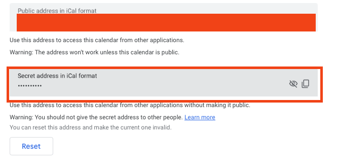

## Features

- [x] Configure your calendar
    - [x] Set your availability via iCal link
        - [x] WIP: [Read here to learn how to connect your Google Calendar](#how-to-get-private-ical-from-google-calendar)
- [x] Share your appointment link (Telegram-native)
- [ ] Your friend can use the link above to booking appointments by sharing their email and confirm the booking confirmation.
- [ ] Notify your friend that booking request has been sent
- [ ] You can accept or cancel the booking
- [ ] Your friend can receive the booking confirmation

## How to get private iCal from Google Calendar

1. Open sharing setting
    
2. Copy the iCal
    